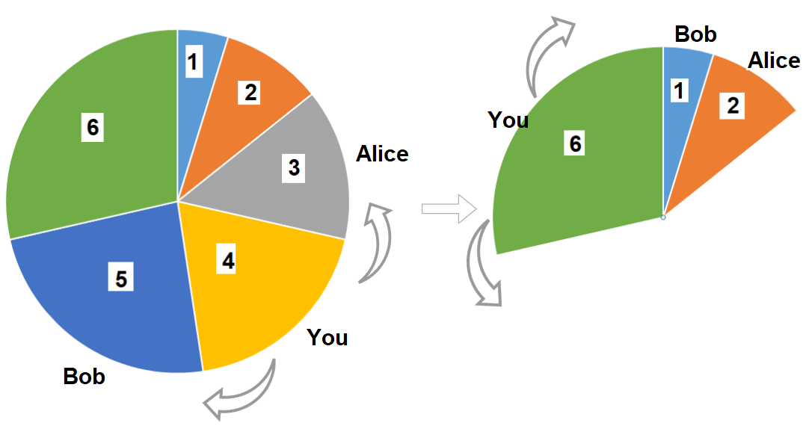

# Dynamic Programming

## code exaple

 **[Dynamic Programming](DynamicProgramming.cpp)**

1. Fibonacci number (Memorization)   **[-Ques](https://www.codingninjas.com/studio/problems/nth-fibonacci-number_74156?leftPanelTab=0&utm_source=youtube&utm_medium=affiliate&utm_campaign=Lovebabbar)**
2. Fibonacci number (Tabulation)
3. Fibonacci number (space optimization)

4. Minimum Cost Climbing Stairs (Recursion)   **[-Ques](https://leetcode.com/problems/min-cost-climbing-stairs/)**
5. Minimum Cost Climbing Stairs (Memorization)
6. Minimum Cost Climbing Stairs (Tabulation)
7. Minimum Cost Climbing Stairs (Space optimization)

8. Minimum Number of Coins (Recursion)     **[-Ques](https://www.codingninjas.com/studio/problems/minimum-elements_3843091?leftPanelTab=0&utm_source=youtube&utm_medium=affiliate&utm_campaign=Lovebabbar)**
9. Minimum Number of Coins (Memorization)
10. Minimum Number of Coins (Tabulation)

11. Maximum Sum of Non-Adjacent Elements (Recursion)    **[-Ques](https://www.codingninjas.com/studio/problems/maximum-sum-of-non-adjacent-elements_843261?leftPanelTab=0&utm_source=youtube&utm_medium=affiliate&utm_campaign=Lovebabbar)**
12. Maximum Sum of Non-Adjacent Elements (Memorization)
13. Maximum Sum of Non-Adjacent Elements (Tabulation)
14. Maximum Sum of Non-Adjacent Elements (Space optimization)

15. House Robbery Problem (Recursion)        **[-Ques](https://www.codingninjas.com/studio/problems/house-robber_839733?leftPanelTab=0&utm_source=youtube&utm_medium=affiliate&utm_campaign=Lovebabbar)**
16. House Robbery Problem (Memorization)
17. House Robbery Problem (Tabulation)
18. House Robbery Problem (Space optimization)

19. Cut Rod into Segments of X, Y, Z (Recursion)      **[-Ques](https://www.codingninjas.com/studio/problems/cut-into-segments_1214651?topList=love-babbar-dsa-sheet-problems&leftPanelTab=0)**
20. Cut Rod into Segments of X, Y, Z (Memorization)
21. Cut Rod into Segments of X, Y, Z (Tabulation)
22. Cut Rod into Segments of X, Y, Z

23. Count derangements (Recursion)  (ith index doesn't stay at ith position --> how may combination?)   **[-Ques](https://www.codingninjas.com/studio/problems/count-derangements_873861?leftPanelTab=0)**
24. Count derangements (Memorization)
25. Count derangements (Tabulation)
26. Count derangements (Space optimization)

27. Painting Fence Algorithm (Recursion)      -**[-Ques](https://www.codingninjas.com/studio/problems/ninja-and-the-fence_3210208?topList=love-babbar-dsa-sheet-problems&leftPanelTab=0)**
28. Painting Fence Algorithm (Memorization)
29. Painting Fence Algorithm (Tabulation)
30. Painting Fence Algorithm (Space optimization)

31. KnapSack Problem (Recursion)   -**[-Ques](https://www.codingninjas.com/studio/problems/0-1-knapsack_920542?topList=love-babbar-dsa-sheet-problems&leftPanelTab=0)**
32. KnapSack Problem (Memorization)
33. KnapSack Problem (Tabulation)
34. KnapSack Problem (Space optimization - two vector)
35. KnapSack Problem (More Space optimization - one vector)

36. Combination Sum (Recursion)     -**[-Ques](https://www.codingninjas.com/studio/problems/number-of-ways_3755252?leftPanelTab=0)**
37. Combination Sum (Memorization)
38. Combination Sum (Tabulation)

39. Perfect Squares Problem (Recursion)   -**[-Ques](https://practice.geeksforgeeks.org/problems/get-minimum-squares0538/1)**
40. Perfect Squares Problem (Memorization)
41. Perfect Squares Problem (Tabulation)
42. Perfect Cube Problem (Recursion)

43. Minimum Cost for Tickets (Recursion)   -**[-Ques](https://www.codingninjas.com/studio/problems/minimum-coins_2180776?leftPanelTab=0)**
44. Minimum Cost for Tickets (Memorization)
45. Minimum Cost for Tickets (Tabulation)
46. Minimum Cost for Tickets (Space optimization)

47. Largest Square area in Matrix (Recursion)   -**[-Ques](https://practice.geeksforgeeks.org/problems/largest-square-formed-in-a-matrix0806/1)**
48. Largest Square area in Matrix (Memorization)
49. Largest Square area in Matrix (Tabulation)
50. Largest Square area in Matrix (Space optimization)

51. Min Score Triangulation of Polygon (Recursion) -**[-Ques](https://leetcode.com/problems/minimum-score-triangulation-of-polygon/)**
52. Min Score Triangulation of Polygon (Memorization)
53. Min Score Triangulation of Polygon (Tabulation)

54. Minimum Sideways Jump (Recursion)   -**[-Ques](https://leetcode.com/problems/minimum-sideway-jumps/)**
55. Minimum Sideways Jump (Memorization)
56. Minimum Sideways Jump (Tabulation)
57. Minimum Sideways Jump (Space optimization)

58. Reducing Dishes (Recursion)       -**[-Ques](https://leetcode.com/problems/reducing-dishes/)**
59. Reducing Dishes (Memorization)
60. Reducing Dishes (Tabulation)
61. Reducing Dishes (Space optimization)

62. Longest Increasing Subsequence (Recursion)      -**[-Ques](https://practice.geeksforgeeks.org/problems/longest-increasing-subsequence-1587115620/1)**
63. Longest Increasing Subsequence (Memorization)
64. Longest Increasing Subsequence (Tabulation)
65. Longest Increasing Subsequence (Space optimization)
66. Longest Increasing Subsequence (DP + BinarySearch)
67. Russian Doll (DP + BinarySearch)      -**[-Ques](https://leetcode.com/problems/russian-doll-envelopes/)**

68. Maximum Height by Stacking Cuboid (Tabulation)      -**[-Ques](https://leetcode.com/problems/maximum-height-by-stacking-cuboids/)**

69. Pizza with 3n size (Recursion)      -**[-Ques](https://leetcode.com/problems/pizza-with-3n-slices/)**
70. Pizza with 3n size (Memorization)
71. Pizza with 3n size (Tabulation)
72. Pizza with 3n size (Space optimization)

73. Number of Dice Rolls with Target Sum (Recursion)      -**[-Ques](https://practice.geeksforgeeks.org/problems/dice-throw5349/1)**
74. Number of Dice Rolls with Target Sum (Memorization)
75. Number of Dice Rolls with Target Sum (Tabulation)
76. Number of Dice Rolls with Target Sum (Space optimization)

77. Partition Equal Subset Sum (Recursion)      -**[-Ques](https://practice.geeksforgeeks.org/problems/subset-sum-problem2014/1)**
78. Partition Equal Subset Sum (Memorization)
79. Partition Equal Subset Sum (Tabulation)
80. Partition Equal Subset Sum (Space optimization)

81. Minimum Swap to Make Sequence Increasing (Recursion)      -**[-Ques](https://leetcode.com/problems/minimum-swaps-to-make-sequences-increasing/)**
82. Minimum Swap to Make Sequence Increasing (Memorization)
83. Minimum Swap to Make Sequence Increasing (Tabulation)
84. Minimum Swap to Make Sequence Increasing (Space optimization)

85. Longest Arithmetic Subsequence (Recursion)        -**[-Ques](https://practice.geeksforgeeks.org/problems/longest-arithmetic-progression1019/1)**
86. Longest Arithmetic Subsequence (Memorization)
87. Longest Arithmetic Subsequence (Tabulation)

88.  Longest AP with given Difference "d" (Hashmap)   -**[-Ques](https://leetcode.com/problems/longest-arithmetic-subsequence-of-given-difference/)**

89. Unique Binary Search Trees or Catalan Number (Recursion)      -**[-Ques](https://leetcode.com/problems/unique-binary-search-trees/)**
90. Unique Binary Search Trees or Catalan Number (Memorization)
91. Unique Binary Search Trees or Catalan Number (Tabulation)

92. Guess Number Higher or Lower (Recursion)     -**[-Ques](https://leetcode.com/problems/guess-number-higher-or-lower-ii/)**
93. Guess Number Higher or Lower (Memorization)
94. Guess Number Higher or Lower (Tabulation)

95. Minimum Cost Tree From Leaf Values

96. Buy and Sell Stock [I]              -**[-Ques](https://leetcode.com/problems/best-time-to-buy-and-sell-stock/)**

97. Buy and Sell Stock [II] (Recursion)  -**[-Ques](https://leetcode.com/problems/best-time-to-buy-and-sell-stock-ii/description/)**
98. Buy and Sell Stock [II] (Memorization)
99. Buy and Sell Stock [II]  (Tabulation) 
100. Buy and Sell Stock [II] (Space optimization)

101. Buy and Sell Stock [III] (Recursion)  -**[-Ques](https://leetcode.com/problems/best-time-to-buy-and-sell-stock-iii/description/)**
102. Buy and Sell Stock [III] (Memorization)
103. Buy and Sell Stock [III] (Tabulation) 
104. Buy and Sell Stock [III] (Space optimization)

105. Buy and Sell Stock [IV] (Space optimization + Alternative)   -**[-Ques](https://leetcode.com/problems/best-time-to-buy-and-sell-stock-iv/)**
106. Buy and Sell Stock [IV] (Recursion)
107. Buy and Sell Stock [IV] (Memorization)
108. Buy and Sell Stock [IV] (Tabulation)
109. Buy and Sell Stock [IV] (Space optimization)

110. Buy and Sell Stock [V] (Space optimization)  -**[-Ques](https://leetcode.com/problems/best-time-to-buy-and-sell-stock-with-transaction-fee/)**

111. Longest Common Subsequence (Recursion)    -**[-Ques](https://leetcode.com/problems/longest-common-subsequence/)**
112. Longest Common Subsequence (Memorization)
113. Longest Common Subsequence (Tabulation)
114. Longest Common Subsequence (Space optimization)

115. Longest Pelindromic Subsequence (Recursion)  -**[-Ques](https://leetcode.com/problems/longest-palindromic-subsequence/)**
116. Longest Pelindromic Subsequence (Memorization)
117. Longest Pelindromic Subsequence (Tabulation)
118. Longest Pelindromic Subsequence (Space optimization)

119. Edit Distance (Recursion)    -**[-Ques](https://leetcode.com/problems/edit-distance/)**
120. EDIT Distance (Memorization)
121. EDIT Distance (Tabulation)
122. EDIT Distance (Space optimization)

